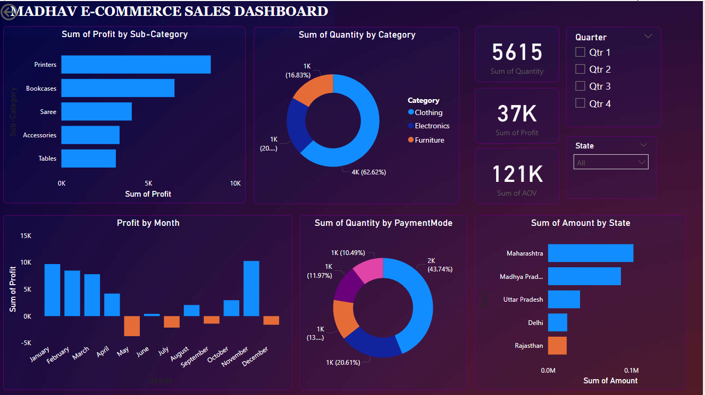

# 📊 E-commerce Sales Analysis Dashboard

This project analyzes e-commerce sales data to uncover insights related to product performance, customer behavior, and revenue trends. A Power BI dashboard was created to present findings through interactive visualizations.

## 🧰 Tools & Technologies
- **Microsoft Power BI**
- **Excel**
- **DAX (Data Analysis Expressions)**
- **CSV (Comma-Separated Values)**

## 📁 Project Structure

- `data/`: Contains raw data files (`Details.csv`, `Orders.csv`) used for analysis.
- `dashboard/`: Contains the `.pbix` file (`Ecommerce_sales.pbix`) which includes the Power BI dashboard.
- `images/`: Contains screenshots of the dashboard for quick reference.
- `README.md`: Documentation and explanation of the project.

## 📈 Dashboard Features

The dashboard includes:

- 📦 **Sum of Profit by Sub-Category**
- 🧾 **Sum of Quantity by Category**
- 📅 **Profit by Month**
- 💳 **Quantity by Payment Mode**
- 🌍 **Sales Breakdown by State**
- 📊 **Dynamic filters** for Quarter and State

## 📌 Key Insights

- Printers and Bookcases contributed the highest profit among sub-categories.
- Clothing dominated quantity-wise, while Electronics led in value.
- Maharashtra generated the highest revenue among all states.
- Seasonal patterns reveal dips in May and June, followed by strong performance in Q4.

## 🚀 How to Use

1. Download the `.pbix` file from the `dashboard/` folder.
2. Open it using **Power BI Desktop**.
3. Ensure all data files from `data/` are present in the same folder to avoid missing data errors.

## 🔗 Author

**Janhvi Chandnani**  

